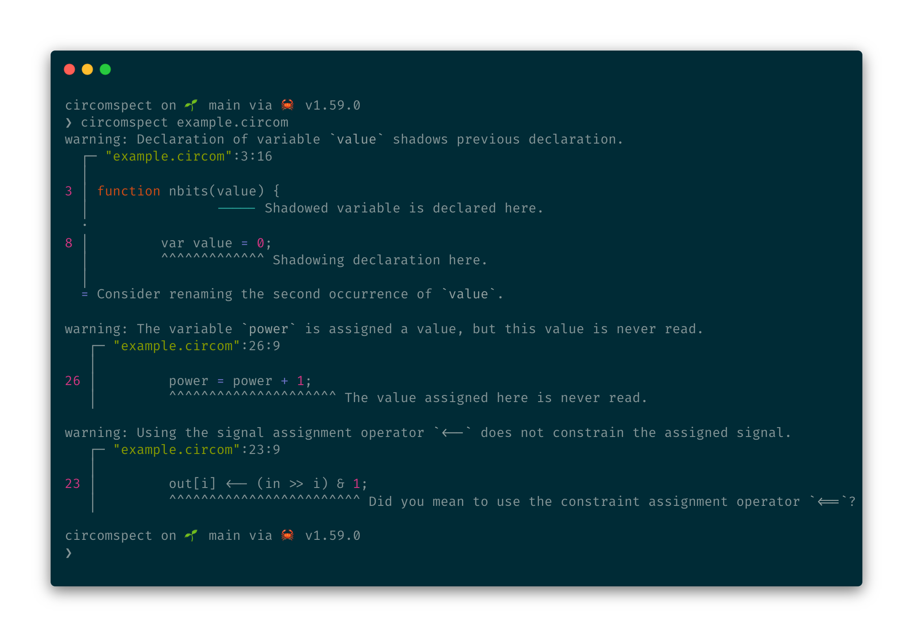

# Circomspect

Circomspect is a static analyzer and linter for the Circom programming language.
The codebase borrows heavily from the Rust Circom compiler built by iden3.

Circomspect currently implements a number of analysis passes which can identify potential issues with the code. It is our goal to continue to add new analysis passes to be able to detect more issues in the future.

The project currently implements analysis passes for the following types of issues.

1. Shadowing variable declarations.
2. Unused variable assignments.
3. Signal assignments using the signal assignment operator `<--`.
4. Branching statement conditions that always evaluate to either  `true` or `false`.
5. Arithmetic expressions.
6. Field element comparisons.
